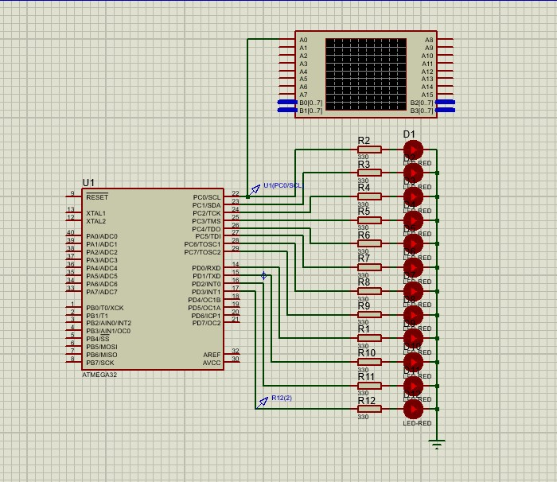
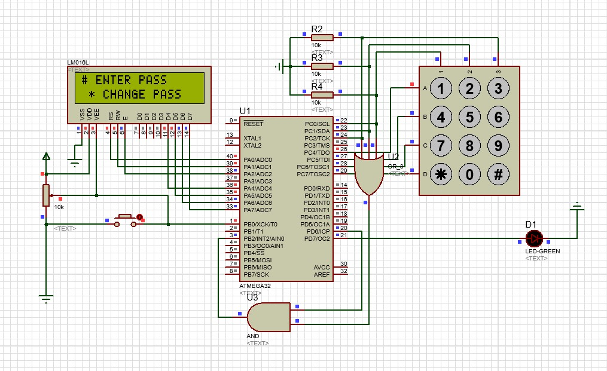

# Bachlor-Microcontroller
 I put some of the important assignment and project during my Microcontroller course. Most of the answers include a video that has been uploaded on YouTube.

In each following section you can see the picture of Proteus enviorment. Just tap on it.
# During this course I just used `ATMEGA32`.

## [1-Intro](1-Intro/README.md) (<a href="https://www.youtube.com/watch?v=L6JzgI2_S3E" target="blank">video</a>)

## [2-Turn on-off Red LED](2-Turn%20on-off%20Red%20LED/README.md)
## [3-Dip switch to led](3-Dip%20switch%20to%20led/README.md)
## [4 -Shift and Increament](4%20-Shift%20and%20Increament/README.md)
## [5-Seven Segment](5-Seven%20Segment/README.md) (<a href="https://youtu.be/mwd65dJJYjc" target="blank">video</a>)
## [6- Four Seven Segment Show Static Number](6-%20Four%20Seven%20Segment%20Show%20Static%20Number/README.md) (<a href="https://youtu.be/6fXMDOYOan0" target="blank">video</a>)
## [7- 4x4 Matrix Pad](7-%204x4%20Matrix%20Pad/README.md)
## [8- 4x4 Keyboard Multiplex Seven Segment](8-%204x4%20Keyboard%20Multiplex%20Seven%20Segment/README.md)
## [9- LCD Show Name](9-%20LCD%20Show%20Name/README.md) (<a href="https://youtu.be/-6Qn1ZHHrW8" target="blank">video</a>)
## [10- LCD & Keyboard](10-%20LCD%20&%20Keyboard/README.md)
## [11-ADC Show Temperature](11-ADC%20Show%20Temperature/README.md)
## [12-LCD & Keyboard + Interupt](12-LCD%20&%20Keyboard%20+%20Interupt/README.md)
## [13-Password Based Door Lock System - EEPROM, Transistor](13-Final/README.md) (<a href="https://youtu.be/Cq3QeL-kXac" target="blank">video</a>)

|  |  |
| :-------------------------------------------------: | :------------------------: |
|                                |      |

For more info and pictures go to each section.